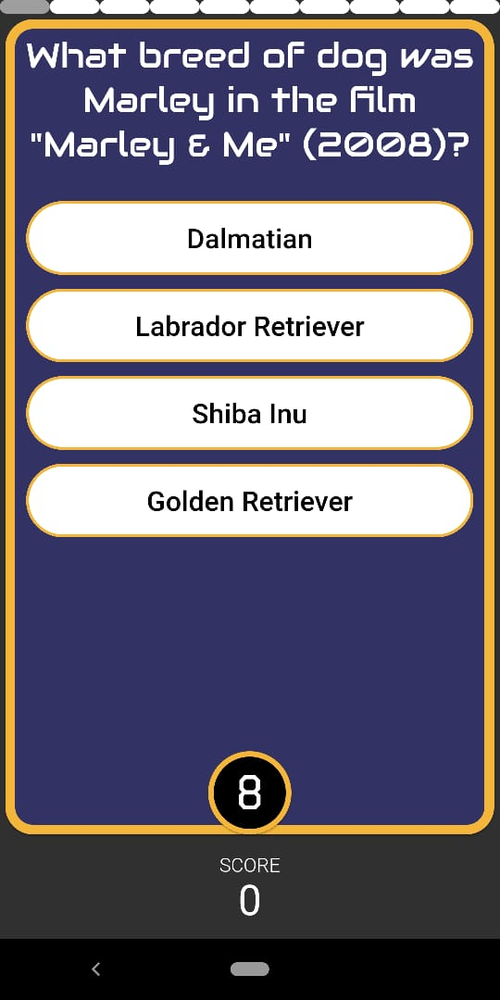

# quiz_app

A quiz app built using Flutter backend is built using Firebase and Open Trivia Database API is used for fetching questions.

**[Demo video🎬](https://youtu.be/Kj4uTd9GC1k)**

____________

____________

